# Global Household AIOps

An end-to-end **MLOps + GenAIOps portfolio project** built around household financial-health analytics. The project extends a traditional machine-learning workflow with MLflow lifecycle management, a routed GenAI/RAG application, automated evaluation, FastAPI serving, Docker, observability, CI/CD, and Azure infrastructure provisioned with Bicep.

> **Portfolio goal:** demonstrate how a data-science solution can be operationalised across the ML and GenAI lifecycles rather than stopping at model training or a notebook.

--------------------------------------------------------------------------------------------------------------------------------------------------------------------------------

## Highlights

-   **MLOps:** reproducible training, feature engineering, automated tests, MLflow tracking/model packaging, champion model workflow, and Azure ML model registration.
-   **GenAIOps:** query routing, RAG, structured-data answering, regression tests, evaluation gates, and LLM-provider abstraction.
-   **Serving:** FastAPI with health/readiness endpoints and `/api/chat`.
-   **Cloud AI:** Microsoft Foundry project and hosted model deployment for cloud LLM inference.
-   **Local AI:** Foundry Local integration for cost-aware local experimentation.
-   **Observability:** OpenTelemetry instrumentation exported to Azure Application Insights / Log Analytics.
-   **Infrastructure as Code:** modular Bicep for Foundry, model deployment, monitoring, and Azure Machine Learning.
-   **CI/CD:** GitHub Actions for ML training, GenAI evaluation, Docker validation, and IaC validation.
-   **Cost-aware design:** cloud resources are minimal and temporary; Azure ML managed-online inference was tested but not left running.

--------------------------------------------------------------------------------------------------------------------------------------------------------------------------------

## Business Problem

The underlying household dataset contains financial and demographic attributes including country, city, family size, number of earners, primary income, total household income, estimated taxes, and monthly expenses.

The wider solution analyses household financial health and supports questions about the analysis through a conversational interface. Instead of treating model development, RAG, deployment, testing, and monitoring as separate demos, this repository brings them together into one operational AI system.

--------------------------------------------------------------------------------------------------------------------------------------------------------------------------------

## Architecture

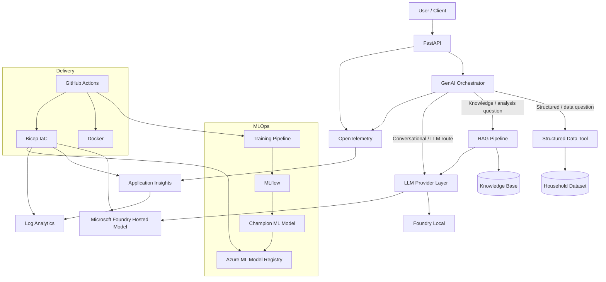

### Project Architecture
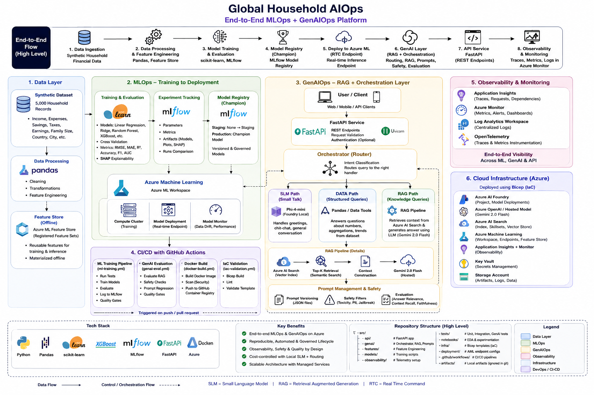

--------------------------------------------------------------------------------------------------------------------------------------------------------------------------------

## Request Flow

A request enters through FastAPI and is passed to the GenAI orchestrator. The orchestrator separates questions by intent so that an
LLM is **not used for every request**:

1.  **Structured data path** --- deterministic questions that can be answered from the household dataset use the data layer.
2.  **RAG path** --- questions about analytical findings or project knowledge retrieve relevant context before generation.
3.  **LLM/conversational path** --- conversational requests are delegated to the configured model provider.

This improves reliability and avoids unnecessary LLM usage for questions that can be answered deterministically.

--------------------------------------------------------------------------------------------------------------------------------------------------------------------------------

## MLOps Lifecycle

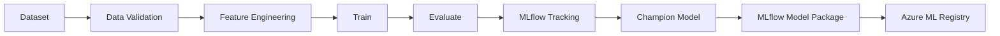

The workflow demonstrates reusable feature engineering, automated dataset validation, training/evaluation, ML pipeline tests, MLflow tracking, champion model selection/export, MLflow signature validation, Azure ML workspace provisioning, and Azure ML model registration/versioning.

The registered Azure ML model accepts:

  Feature                    Type
  -------------------------- --------
  `Country`                  string
  `City`                     string
  `Family_Size`              double
  `Num_Earners`              double
  `Primary_Income`           double
  `Total_Household_Income`   double
  `Estimated_Taxes`          double
  `Monthly_Expenses`         double

--------------------------------------------------------------------------------------------------------------------------------------------------------------------------------

## GenAIOps Lifecycle

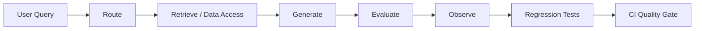

The GenAI layer is treated as an operational software component rather than only a chatbot. Automated checks cover routing behaviour, RAG behaviour, regression scenarios, API behaviour, deterministic data responses, GenAI evaluation, and failure handling.

For example, regression tests verify that questions about analytical findings such as statistical tests are routed to the knowledge/RAG path rather than incorrectly treated as direct structured-data queries.

--------------------------------------------------------------------------------------------------------------------------------------------------------------------------------

## RAG and Knowledge Layer

The RAG path is designed for questions that require analytical context rather than a direct calculation from the raw dataset.

``` text
User question
     |
     v
Intent routing
     |
     v
Knowledge retrieval
     |
     v
Relevant context
     |
     v
LLM generation
     |
     v
Grounded response
```

The raw dataset and conclusions produced during analysis are deliberately treated as different information sources.

--------------------------------------------------------------------------------------------------------------------------------------------------------------------------------

## LLM Strategy

The project uses a provider abstraction so inference is not tightly coupled to one runtime.

### Microsoft Foundry

A Microsoft Foundry resource, project, and hosted model deployment are provisioned through Azure/Bicep. The hosted deployment was validated with a successful OpenAI-compatible API inference request.

### Foundry Local

Foundry Local supports local model experimentation and cost-aware development. Windows-specific dependencies are separated from general cross-platform requirements so Linux CI runners do not attempt to install Windows-only packages.

### Provider configuration

Credentials and runtime configuration are supplied through environment variables. Secrets are not intended to be committed to source control.

--------------------------------------------------------------------------------------------------------------------------------------------------------------------------------

## API

Start locally:

``` bash
uvicorn src.api.main:app --reload
```

Open Swagger UI at `http://127.0.0.1:8000/docs`.

  Endpoint           Purpose
  ------------------ ----------------------------------------
  `GET /health`      Basic application health
  `GET /ready`       Dependency/readiness status
  `POST /api/chat`   Routed conversational/data/RAG request

Example:

``` json
{
  "query": "Good morning"
}
```

The readiness endpoint checks application dependencies rather than merely confirming that the web process is alive.

--------------------------------------------------------------------------------------------------------------------------------------------------------------------------------

## Observability

The API and orchestration layer are instrumented with **OpenTelemetry**, with telemetry exported to **Azure Application Insights** and **Log Analytics**.

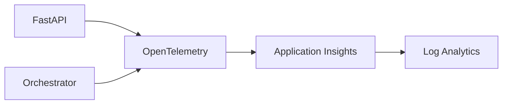

Telemetry initialisation is environment-driven, allowing the same codebase to run locally and in CI without requiring an Application Insights connection.

--------------------------------------------------------------------------------------------------------------------------------------------------------------------------------

## Infrastructure as Code

Azure infrastructure is defined with **Bicep** under `infra/`.

``` text
infra/
├── main.bicep
├── main.parameters.json
└── modules/
    ├── aml.bicep
    ├── foundry.bicep
    ├── model-deployment.bicep
    └── monitoring.bicep
```

The cloud architecture includes:

``` text
Resource Group
├── Microsoft Foundry
│   ├── Foundry Project
│   └── Hosted Model Deployment
├── Azure Machine Learning Workspace
│   ├── Storage Account
│   └── Key Vault
├── Application Insights
└── Log Analytics Workspace
```

Build:

``` bash
az bicep build --file infra/main.bicep
```

Validate:

``` bash
az deployment group validate \
  --resource-group <resource-group> \
  --template-file infra/main.bicep \
  --parameters infra/main.parameters.json
```

--------------------------------------------------------------------------------------------------------------------------------------------------------------------------------

## Azure ML Managed Endpoint Experiment

The champion MLflow model was successfully registered and versioned in Azure Machine Learning. A managed online endpoint and deployment specification were also created and tested.

The recommended `Standard_DS3_v2` deployment could not be provisioned because the learning subscription did not expose sufficient CPU quota for that managed-online deployment. A smaller `Standard_DS1_v2` instance was also evaluated, but it was below the recommended resource level and its inference container failed the liveness probe.

Because this portfolio project is designed to minimise cloud cost, no quota increase was requested and no always-on Azure ML endpoint is required to run the project.

**Model registration/versioning succeeded; managed cloud inference was constrained by subscription capacity.**

--------------------------------------------------------------------------------------------------------------------------------------------------------------------------------

## Docker

Build the API image:

``` bash
docker build -t global-household-aiops:local .
```

The Docker workflow is separated from Windows-only Foundry Local dependencies so the Linux image remains portable.

------------------------------------------------------------------------

## CI/CD

Four focused GitHub Actions workflows are used:

  -----------------------------------------------------------------------
  Workflow                            Responsibility
  ----------------------------------- -----------------------------------
  **ML Training Pipeline**            unit tests, dataset validation, MLflow service, training/evaluation, ML pipeline tests, artifacts

  **GenAI Evaluation**                GenAI/RAG/routing regression and quality checks

  **Docker Build**                    validates that the application container builds

  **IaC Validation**                  validates/builds the Bicep infrastructure
  -----------------------------------------------------------------------

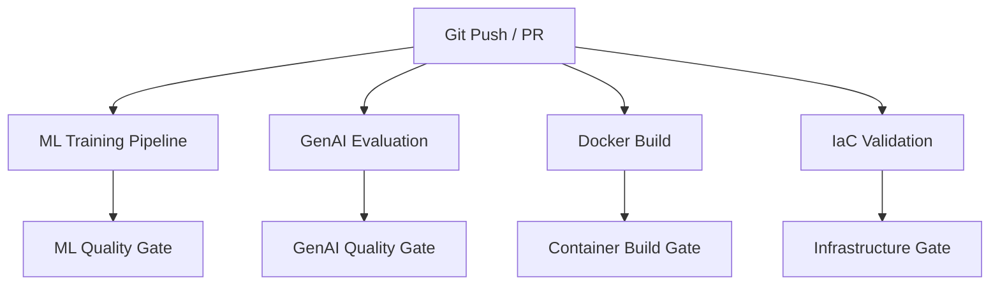

--------------------------------------------------------------------------------------------------------------------------------------------------------------------------------

## Testing

Tests are separated by responsibility:

``` text
tests/
├── unit/
├── integration/
├── genai/
└── api/
```

Run the complete suite:

``` bash
pytest tests/unit tests/integration tests/genai tests/api -v
```

The strategy covers conventional application logic plus AI-specific behaviours such as routing and regression.

--------------------------------------------------------------------------------------------------------------------------------------------------------------------------------

## Repository Structure

``` text
Global_Household_AIOps/
├── .github/workflows/
├── api/
├── data/
├── deployment/
│   ├── aml/
│   ├── azure/
│   └── local/
├── docs/
├── evaluation/
├── infra/
│   ├── main.bicep
│   └── modules/
├── knowledge/
├── ml/
├── monitoring/
├── notebooks/
├── prompts/
├── screenshots/
├── src/
│   ├── api/
│   ├── features/
│   ├── genai/
│   └── observability/
├── tests/
├── Dockerfile
├── pyproject.toml
├── requirements.txt
├── requirements-api.txt
└── requirements-local-win.txt
```

Generated model artifacts, local MLflow state, secrets, virtual environments, and generated ARM JSON are excluded from source control.

--------------------------------------------------------------------------------------------------------------------------------------------------------------------------------

## Local Setup

### 1. Clone

``` bash
git clone https://github.com/24gshreya/Global_Household_AIOps.git
cd Global_Household_AIOps
```

### 2. Create a virtual environment

Windows:

``` powershell
python -m venv .venv
.venv\Scripts\Activate.ps1
```

Linux/macOS:

``` bash
python -m venv .venv
source .venv/bin/activate
```

### 3. Install dependencies

``` bash
python -m pip install --upgrade pip
pip install -r requirements.txt
```

For Windows Foundry Local development where required:

``` bash
pip install -r requirements-local-win.txt
```

### 4. Configure environment

Copy `.env.example` to `.env` and populate only the providers/services you intend to use. `.env` is ignored by Git.

### 5. Run tests

``` bash
pytest tests/unit tests/integration tests/genai tests/api -v
```

### 6. Start the API

``` bash
uvicorn src.api.main:app --reload
```

--------------------------------------------------------------------------------------------------------------------------------------------------------------------------------

## Security and Configuration

-   credentials are supplied through environment variables
-   `.env` files are excluded from Git
-   `.env.example` contains configuration names/placeholders only
-   Azure keys and connection strings are not stored in Bicep source
-   generated/local model artifacts are excluded from Git
-   Windows-specific local-AI dependencies are isolated from Linux CI
    dependencies

For production, additional controls such as managed identity, Key Vault references, private networking, RBAC hardening, image scanning, and deployment approvals would be appropriate.

--------------------------------------------------------------------------------------------------------------------------------------------------------------------------------

## Cost-Control Decisions

The project demonstrates cloud operationalisation without maintaining
unnecessary paid infrastructure:

-   Foundry Local for local AI experimentation
-   temporary Azure resources for portfolio validation
-   no permanent Azure ML managed online endpoint
-   IaC so infrastructure can be recreated instead of left running
-   deterministic data routing to avoid unnecessary LLM calls
-   separation of local and cloud model providers

--------------------------------------------------------------------------------------------------------------------------------------------------------------------------------

## Evidence / Screenshots

### Azure Infrastructure
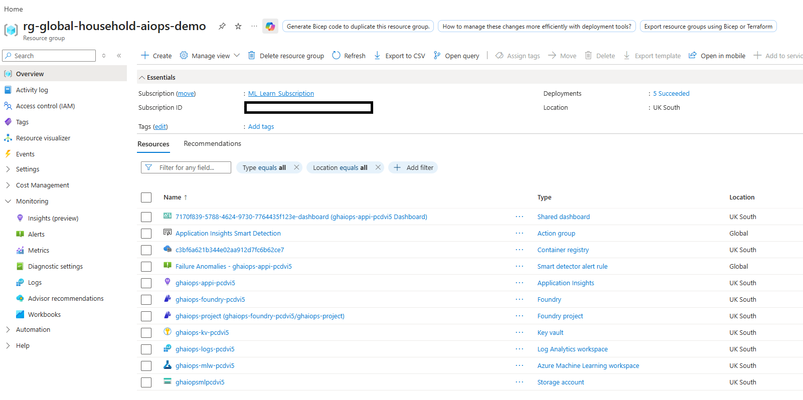

### MLflow Experiment Tracking
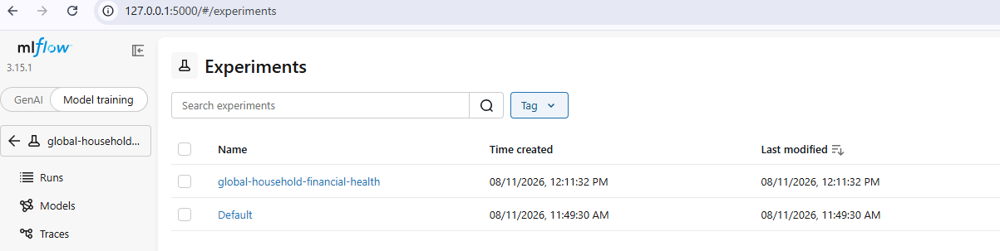

### Azure ML Model Registration
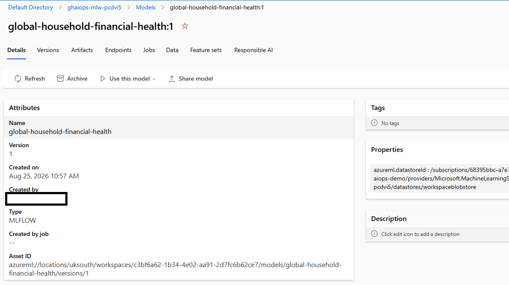

### Microsoft Foundry Inference
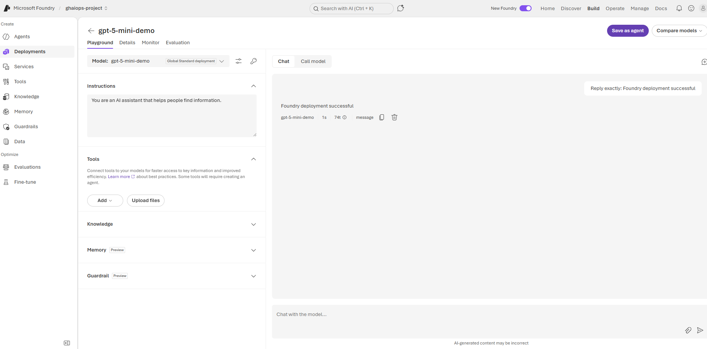

### API
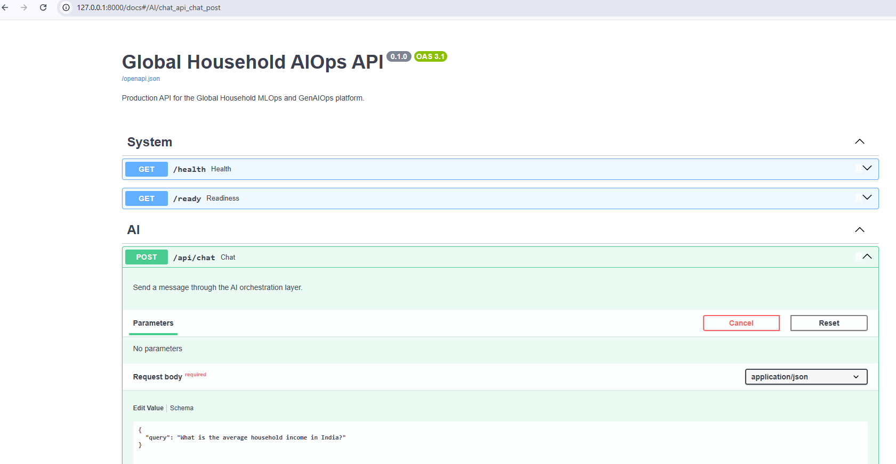

### Observability
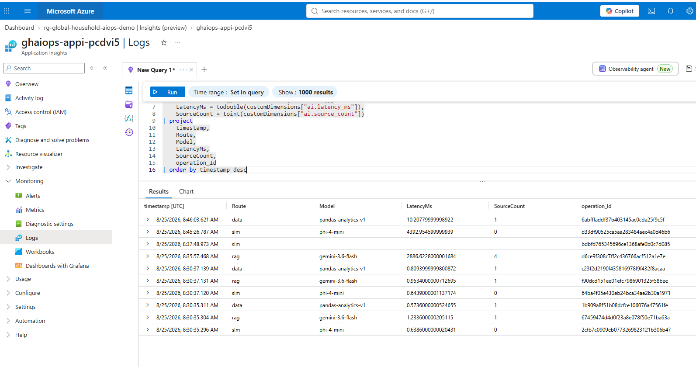

### CI/CD
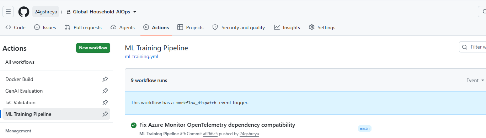

--------------------------------------------------------------------------------------------------------------------------------------------------------------------------------

## Key Engineering Decisions

**Why route instead of sending every question to an LLM?**\
Structured questions are more reliable and cheaper when answered deterministically. RAG is reserved for questions requiring contextual knowledge, while LLM inference handles requests that genuinely benefit from generation.

**Why MLflow plus Azure ML?**\
MLflow provides a portable model lifecycle and packaging format. Azure ML demonstrates cloud registration, governance, versioning, and deployment integration.

**Why separate ML and GenAI CI workflows?**\
Traditional model validation and GenAI quality evaluation fail for different reasons. Independent pipelines make those quality gates visible and maintainable.

**Why Bicep?**\
The cloud environment can be reproduced from source instead of depending on manually created portal resources.

**Why OpenTelemetry?**\
Observability remains in application code using an open instrumentation standard while Application Insights provides the cloud monitoring backend.

--------------------------------------------------------------------------------------------------------------------------------------------------------------------------------

## Skills Demonstrated

**Machine Learning / MLOps:** Python · pandas · scikit-learn · MLflow · model evaluation · feature engineering · model packaging · Azure Machine Learning

**Generative AI / GenAIOps:** RAG · LLM routing · prompt/evaluation workflows · regression testing · Microsoft Foundry · Foundry Local

**Software / Platform Engineering:** FastAPI · pytest · Docker · GitHub Actions · OpenTelemetry

**Azure / Infrastructure:** Bicep · Application Insights · Log Analytics · Azure ML · Microsoft Foundry · Key Vault · Storage

--------------------------------------------------------------------------------------------------------------------------------------------------------------------------------

## Future Improvements

-   deploy the ML model to a managed endpoint when suitable Azure ML quota is available
-   use managed identity instead of key-based authentication
-   add private endpoints and restricted network access
-   automate model promotion based on evaluation thresholds
-   add richer RAG retrieval metrics and production feedback
-   add drift/data-quality monitoring
-   publish container images to a registry with staged deployment environments
-   add security/image scanning in CI
-   add load/performance testing
-   create production dashboards and alert thresholds

--------------------------------------------------------------------------------------------------------------------------------------------------------------------------------

## Project Context

This repository is the operationalisation layer built around the broader **Global Household Financial Health** project family. Its focus is not only predictive modelling or chatbot development, but the engineering practices required to **test, package, deploy, observe, govern, and reproduce ML and GenAI workloads**.

--------------------------------------------------------------------------------------------------------------------------------------------------------------------------------

## Author

**24gshreya** - Portfolio project focused on Data Science, MLOps, GenAIOps, and Microsoft Azure.

--------------------------------------------------------------------------------------------------------------------------------------------------------------------------------

## Disclaimer

This is a learning and portfolio project. The household data used by the project is synthetic and outputs should not be interpreted as personal financial advice.
